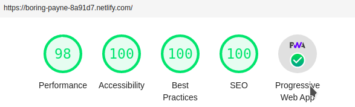

Hoy he aplicado las practicas para obtener un buen puntaje en Lighthouse.

Agregue los plugins `gatsby-plugin-manifest` y `gatsby-source-offline`, para dar
soporte de PWA. 


Ademas como sugiere la documentacion de Gatsby, agrege los plugins
`gatsby-plugin-react-helmet` y la libreria `react-helmet`, para poder agregar
tags `<meta>` y `<title>` a cada una de las paginas (incluidos los posts).

## Agregando soporte de imagenes

Para realizar esto se realizaron los siguientes pasos

```ssh
yarn add gatsby-remark-images gatsby-plugin-sharp
```

y a continuacion como es debido, se activaron los plugin desde
`gatsby-config.js` agregando lo siguiente:

```javascript
...
plugins: [
...

  {
    resolve: `gatsby-transformer-remark`,
    options: {
    ...

    plugins: {
    ...
        `gatsby-remark-images`,
    ...
    }
..
    }
  }
  ...,

  `gatsby-plugin-sharp`,

]

```

### Puntuacion Lighthouse


